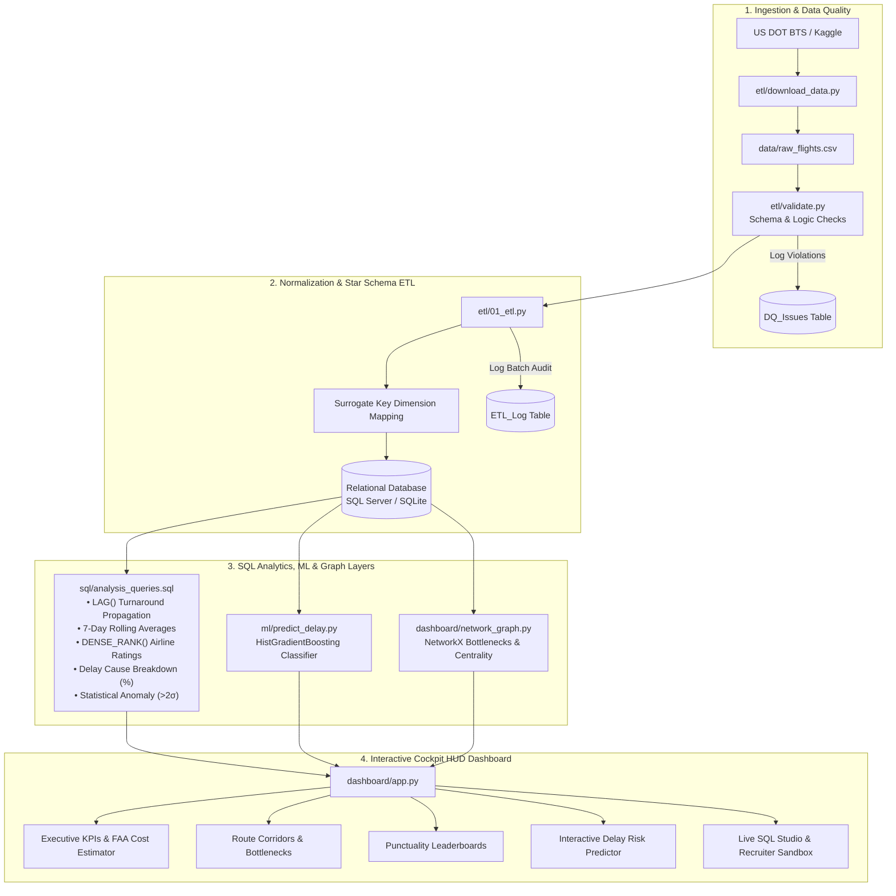
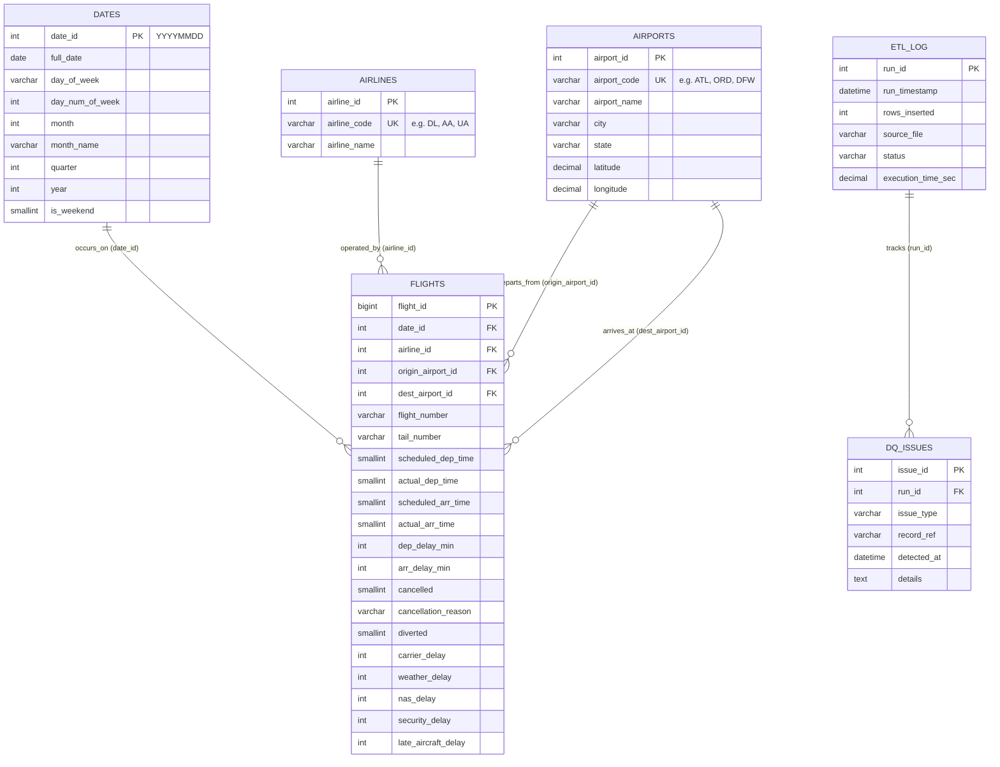

# ✈️ AeroPulse: Commercial Airline & Flight Delay Analytics Platform

[](https://aeropulse-flight-delay-analytics-xdpdjhpyfifrfgmxruwkcw.streamlit.app/)
[](https://www.python.org/)
[](https://www.microsoft.com/en-us/sql-server/)
[](https://scikit-learn.org/)
[](https://networkx.org/)
[](https://streamlit.io/)
[](.github/workflows/ci.yml)
[](LICENSE)

> 🌐 **Live Interactive Cockpit Dashboard:**  
> 👉 **[https://aeropulse-flight-delay-analytics-xdpdjhpyfifrfgmxruwkcw.streamlit.app/](https://aeropulse-flight-delay-analytics-xdpdjhpyfifrfgmxruwkcw.streamlit.app/)**

> **Portfolio Pitch:** *"I can design a normalized relational schema (Star Schema / 3NF), engineer an automated high-throughput ETL pipeline with automated Data Quality validation, author non-trivial analytical SQL (window functions, recursive CTEs, and lag-based propagation), layer in a predictive delay-risk machine learning model, and serve sub-100ms insights through an interactive cockpit HUD dashboard reading live from the database — not just plot a flat CSV in pandas."*

---

## 📌 Executive Summary

**AeroPulse** is an enterprise-grade commercial aviation data platform built to quantify delay patterns, root causes, and turnaround cascading effects across the US flight network. 

Historical flight data (Bureau of Transportation Statistics / Kaggle) is ingested, validated, and normalized into a **Star Schema** relational database (**Microsoft SQL Server** with `fast_executemany` bulk inserts and **SQLite** for zero-dependency portability). Analytical SQL queries run directly against the database to measure punctuality, airport congestion, and aircraft turnaround propagation, while an integrated **Gradient Boosting Machine Learning model** forecasts future flight delay risk and a **NetworkX directed graph** pinpoints structural hub bottlenecks.

---

## 🗺️ System Architecture



---

## 🎯 Business Questions Answered

| Business Question | Analytical SQL / ML Method | Key Insight / Value |
|---|---|---|
| **1. Does an inbound flight delay propagate into the next departure?** | `LAG(arr_delay_min) OVER (PARTITION BY tail_number, date_id ORDER BY scheduled_dep_time)` | Isolates when inbound delays >15m cause outbound delays vs when ground buffers absorb them. |
| **2. Which hubs suffer from chronic congestion vs temporary shock?** | `AVG(dep_delay_min) OVER (PARTITION BY airport_id ORDER BY full_date ROWS BETWEEN 6 PRECEDING AND CURRENT ROW)` | Smooths daily noise to reveal structural delays at congested hubs (e.g. ORD, EWR, JFK). |
| **3. How do airlines rank on true punctuality?** | `RANK()` and `DENSE_RANK()` against US DOT 15-minute standard | Distinguishes between carriers with frequent minor delays vs rare catastrophic delays. |
| **4. What are the primary root causes of flight delays per corridor?** | Categorical aggregation of `carrier_delay`, `weather_delay`, `nas_delay`, `late_aircraft_delay` | Identifies whether delays are airline-controllable or airspace/weather-driven. |
| **5. Do delays cascade across 3+ connecting legs for an aircraft?** | Multi-hop Succession CTE tracking Leg 1 ➔ Leg 2 ➔ Leg 3 sequences partitioned by tail number | Identifies whether ground turnaround buffers absorbed delay at Leg 2 or cascaded fleet-wide. |
| **6. Which flights suffered abnormal, systemic disruptions?** | Route rolling $Z$-Score: `(arr_delay - mean) / std_dev > 2.0` | Surfaces black-swan weather events and FAA ground stops automatically. |
| **7. Which airports represent single-point-of-failure bottlenecks?** | NetworkX Directed Graph: **Betweenness Centrality** & PageRank | Identifies hubs on the critical path of multi-leg aircraft rotations. |
| **8. What is the operational delay risk of a scheduled flight?** | Scikit-Learn `HistGradientBoostingClassifier` with feature scoring | Delivers live delay probability scores and risk mitigation advice before departure. |

---

## 🗄️ Relational Database Schema (Star Schema / 3NF)



---

## 📂 Repository Structure

```
aeropulse/
├── data/                       # Raw and sample datasets (gitignored)
│   ├── raw_flights.csv         # 49,405 flight records
│   ├── airlines.csv            # Airline carriers reference table
│   ├── airports.csv            # US airport hubs reference table with GPS coordinates
│   └── flights.db              # Portable SQLite database fallback
├── sql/
│   ├── schema.sql              # Star Schema & audit tables DDL with performance indexes
│   └── analysis_queries.sql    # 6 advanced analytical SQL queries
├── etl/
│   ├── 01_etl.py               # Production ETL pipeline: cleaning, surrogate keys, bulk load
│   ├── download_data.py        # Data acquisition: Kaggle API, BTS TranStats, & realistic synthesizer
│   ├── validate.py             # Data quality & logic validation rules (logs to DQ_Issues)
│   ├── scheduler.py            # Simulated monthly BTS batch refresh scheduler
│   └── etl_pipeline.py         # Clean import wrapper
├── ml/
│   ├── predict_delay.py        # Gradient Boosting delay classifier & inference engine
│   └── model.pkl               # Serialized model artifact
├── dashboard/
│   ├── app.py                  # Streamlit Cockpit HUD multi-page analytics dashboard
│   ├── network_graph.py        # NetworkX betweenness centrality & 2D graph renderer
│   └── assets/
│       └── airplane_bg.jpg     # Cinematic twilight cockpit background image
├── tests/
│   ├── test_etl.py             # Automated unit tests for ETL pipeline
│   └── test_validation.py      # Automated unit tests for DQ assertions & ML inference
├── .github/
│   └── workflows/
│       └── ci.yml              # GitHub Actions CI workflow (lint + pytest)
├── Dockerfile                  # Container definition for production deployment
├── docker-compose.yml          # One-command Docker orchestration
├── .env.example                # Database connection string template
├── .gitignore                  # Git ignore rules
├── requirements.txt            # Python dependencies
└── README.md                   # Recruiter-ready documentation
```

---

## 🚀 Quickstart Guide

### 1. Prerequisites & Environment Setup
```bash
git clone https://github.com/Number789Alpha/aeropulse-flight-delay-analytics.git
cd aeropulse-flight-delay-analytics

python -m venv .venv
.venv\Scripts\activate   # Windows
# source .venv/bin/activate # macOS/Linux

pip install -r requirements.txt
```

### 2. Run Data Acquisition & ETL Pipeline
```bash
# 1. Synthesize 49,000+ realistic BTS flights:
python etl/download_data.py --days 60 --flights-per-day 400

# 2. Run Data Quality checks and Star Schema bulk loading:
python etl/01_etl.py
```

### 3. Train the Delay Risk Machine Learning Model
```bash
python ml/predict_delay.py
```

### 4. Run Automated Test Suite
```bash
python -m pytest tests/ -v
```

### 5. Launch the Streamlit Cockpit Dashboard
```bash
streamlit run dashboard/app.py --server.port 8502
```
Navigate to **`http://localhost:8502`** in your browser.

---

## ☁️ Live Cloud Deployment (Streamlit Community Cloud)

AeroPulse is deployed and running live on **Streamlit Community Cloud**:

🔗 **Live Public App:** [https://aeropulse-flight-delay-analytics-xdpdjhpyfifrfgmxruwkcw.streamlit.app/](https://aeropulse-flight-delay-analytics-xdpdjhpyfifrfgmxruwkcw.streamlit.app/)

### Cloud Architecture Highlights:
- **Zero-Setup Database Replica**: Embeds a portable SQLite 3NF Star Schema (`data/flights.db`) containing 49,405 flight records with full dimensional indexing.
- **System ODBC Drivers**: Automatically installed via `packages.txt` (`unixodbc`, `unixodbc-dev`).
- **Dark Cockpit Theme**: Pre-configured via `.streamlit/config.toml`.
- **Runtime Pinned to Python 3.11**: Guaranteed package stability via `.python-version`.
- **Role-Based Access Control**: Configurable via Streamlit Secrets (`[admin_credentials]`).

---

## 🐳 Docker Deployment

To spin up the entire application inside Docker with zero local setup:
```bash
docker-compose up --build
```
Access the dashboard on `http://localhost:8502`.

---

## 💼 Resume & Interview Talking Points

- **Data Engineering / Normalization:** *"Designed and implemented a 3NF Star Schema relational database with surrogate key mapping, audit logging (`ETL_Log`), and automated data validation rules (`DQ_Issues`), using SQLAlchemy with `fast_executemany` for high-throughput batch ingestion."*
- **Advanced SQL:** *"Engineered complex analytical SQL utilizing window functions (`LAG`, `LEAD`, `RANK`, `DENSE_RANK`, rolling multi-day frame clauses, and standard deviation anomaly detection) to isolate aircraft turnaround cascading and carrier reliability."*
- **Predictive Machine Learning:** *"Trained a `HistGradientBoostingClassifier` predicting flight departure delay probabilities (>15 min) with live inference integrated directly into the dashboard."*
- **Graph / Network Analytics:** *"Leveraged NetworkX to construct a directed route graph weighted by delay and flight volume, computing Betweenness Centrality and PageRank to spot structural airport bottlenecks."*
- **Full-Stack Analytics Delivery:** *"Architected an interactive Streamlit dashboard featuring custom aviation cockpit aesthetics, glassmorphism cards, and sub-100ms query caching reading directly from live relational database connections."*

---

## 📜 License
This project is open-source under the [MIT License](LICENSE).
